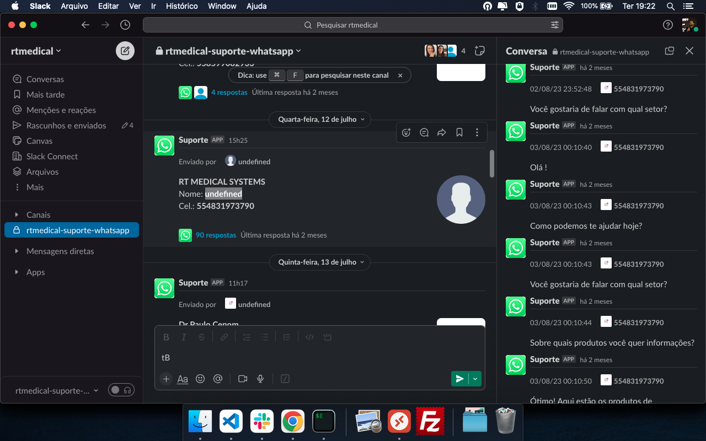

# WhatsAppInSlack

Welcome to the WhatsAppInSlack repository! This project seamlessly integrates your WhatsApp messages into Slack, making your communication much more efficient.

[](https://www.gnu.org/licenses/gpl-3.0)
[](https://github.com/rtmedical/WhatsAppInSlack/issues)
[](https://github.com/rtmedical/WhatsAppInSlack/network/members)
[](https://github.com/rtmedical/WhatsAppInSlack/stargazers)





## Table of Contents
- [Project Structure](#project-structure)
- [Getting Started](#getting-started)
- [Configuration](#configuration)
- [Contributing](#contributing)
- [License](#license)
- [Acknowledgments](#acknowledgments)

## Project Structure
```
│   Dockerfile
│   .env.example
│   README.MD
│   docker-compose.yml
└───app
    │   app.js
    │   db.js
    │   package.json
```

- **Dockerfile**: Contains the configuration to create a Docker image for the application.
- **.env.example**: An example environment file that contains key-value pairs for necessary environment variables. Before starting the application, you'll need to copy this file and name it as `.env`.
- **docker-compose.yml**: Docker Compose configuration file to run the entire application stack.
- **app**: This directory contains the main application logic.
  - **app.js**: The main entry point for our application.
  - **db.js**: Responsible for database operations.
  - **package.json**: Contains metadata about the application and its dependencies.

## Getting Started

1. Clone the repository to your local machine:
```bash
git clone https://github.com/rtmedical/WhatsAppInSlack.git
```

2. Navigate into the project directory:
```bash
cd WhatsAppInSlack
```

3. Copy the `.env.example` file and name the copy as `.env`. Modify the necessary environment variables according to your setup.

4. Using Docker Compose, build and run the application:
```bash
docker-compose up --build
```

The application should now be up and running!

## Configuration

Before starting the application, ensure you have set up the environment variables in the `.env` file. Refer to `.env.example` for required variables.

## Contributing

We love contributions! If you'd like to contribute, please follow these steps:

1. Fork the repository.
2. Create a new feature branch.
3. Commit your changes.
4. Push to your feature branch.
5. Create a new Pull Request.

## License

This project is licensed under the GNU GENERAL PUBLIC LICENSE. See the [LICENSE](LICENSE) file for details.

## Acknowledgments

- To all the developers and contributors who made this project possible, thank you!
- Special thanks to the open-source community for providing invaluable resources and inspiration.

---

For any additional information or questions, please open an issue in the repository. Happy coding! 🚀